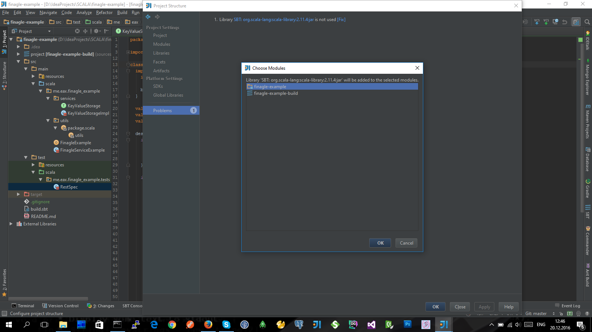
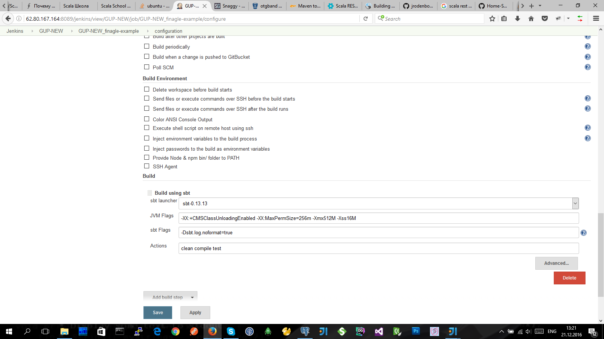

#finagle-example

* [http://eax.me/scalatest/](http://eax.me/scalatest/)
* jdk-1.7.0
* -Dsbt.version=0.13.9

>
1. В SBT-проекте должна присутствовать директория  ' **project** '  с конфиггурационным файлом, внутри нее  ' **plugins.sbt** '.
   А также в корне этого SBT-проекта должен присутствовать основноной конфиггурационный файл  ' **build.sbt** '.
2. Делаем **импорт** SBT-проекта в IntelliJIDEA, при этом выбираем:
   - основноной конфиггурационный файл  ' **build.sbt** ' из корня этого SBT-проекта [IntelliJIDEA/Getting+Started+with+SBT](https://confluence.jetbrains.com/display/IntelliJIDEA/Getting+Started+with+SBT);
   - (ошибка в IntelliJIDEA-14 [SBT-0.13.9 fail java.lang.ClassNotFoundException](https://intellij-support.jetbrains.com/hc/en-us/community/posts/206633295-SBT-0-13-9-fail-java-lang-ClassNotFoundException-org-jetbrains-sbt-ReadProject-)):
     - в  ' **Project SDK** '  выбрать **jdk-1.6.0_31**;
     - разварачиваем и настраиваем пункт **Global SBT settings**
        - добавляем параметр в  ' **VM parameters** ': **-Dsbt.version=0.13.9**;
        - предварительно в  ' **Launcher (sbt-launch.jar)** '  >>  ' **Custom** '  выбрать уже установленный ( **C:\Program Files (x86)\sbt\bin\sbt-launch.jar** ) а после переключить на  ' **Bundled** ';
3. После **импорта** SBT-проекта нужно:
   - в настройках проекта IntelliJIDEA, заменить с **jdk-1.6** на **jdk-1.7.0**;
   - и исправить ошибку зависимостей ( **Add to Dependencies...** );

4. Делаем **сборку** SBT-проекта в Jenkins, **(**итак, уже после установки и настройки плагина  ' **sbt-plugin** '  в Jenkins **|** [Configuring Jenkins plugin for SBT](http://www.cakesolutions.net/teamblogs/2012/01/05/configuring-jenkins-plugin-for-sbt) **|** [I run sbt compile test](http://stackoverflow.com/questions/30103523/is-it-possible-to-do-incremental-testing-with-sbt-and-jenkins) **)**:
   - в Jenkins создаем новую задачу **со свободной конфигурацией**
   - (после подключения репозитория) выбираем и добавляем пункт  ' **Build using sbt** ' и прописываем сюда в форме параметры для сборки SBT-проекта:
     - sbt launcher	**sbt-0.13.13**
     - JVM Flags **-XX:+CMSClassUnloadingEnabled -XX:MaxPermSize=256m -Xmx512M -Xss16M**
     - sbt Flags **-Dsbt.log.noformat=true**
     - Actions **compile test**

